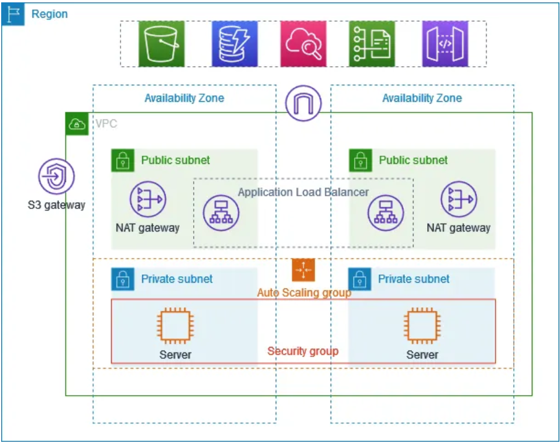

# AWS Highly Available VPC with ALB and Auto Scaling

This project demonstrates a production-style AWS architecture using a custom VPC, public and private subnets, an Application Load Balancer (ALB), Auto Scaling Group (ASG), and Bastion Host.

## Architecture

## Key Components
- Custom VPC with /16 CIDR
- 2 Public + 2 Private subnets across AZs
- Internet Gateway & NAT Gateway
- Bastion Host for secure SSH
- Auto Scaling Group in private subnets
- Application Load Balancer (HTTP 80)
- Python web app running on port 8000

## Documentation
- [VPC Design](docs/vpc-design.md)
- [Security Design](docs/security-design.md)
- [ASG & ALB](docs/asg-alb.md)
- [Testing & Validation](docs/testing.md)

## Result
Application deployed in private subnets and successfully accessed via ALB DNS.

