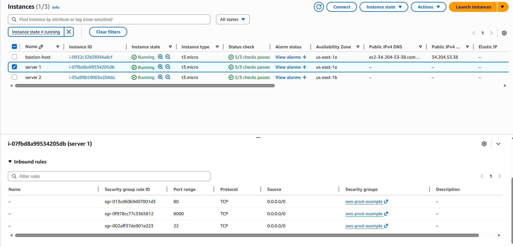
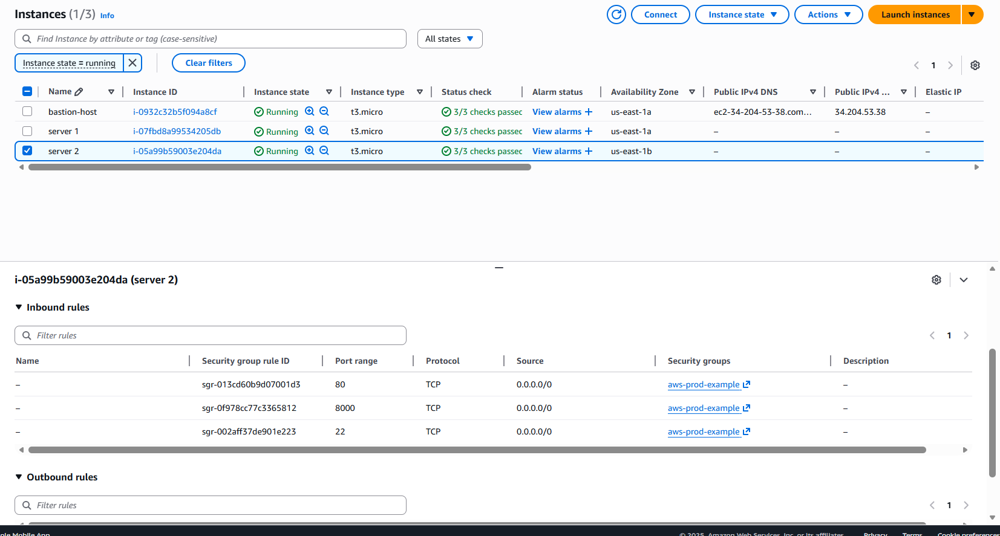
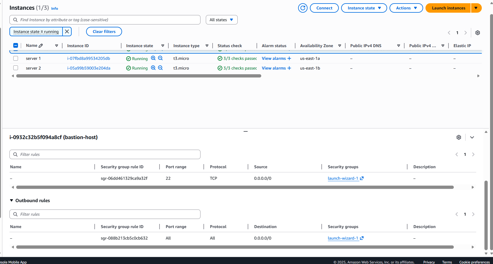

## Security Groups

### Bastion Host Security Group
- SSH (22) allowed **only from my public IP**
- Used to securely access private EC2 instances

---

### Application EC2 Security Group
- Port **8000** allowed only from **ALB Security Group**
- SSH (22) allowed only from **Bastion Security Group**

---

## Bastion Host Access Validation

The following screenshot confirms secure SSH access:
- Key copied using `scp`
- SSH into bastion host successful

---

## Network ACLs
- Default NACLs used
- Stateless rules
- No overly permissive inbound rules
